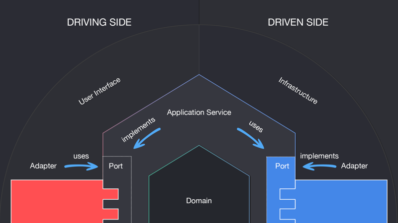

# CartChain

Proof of concept for an e-commerce API implementing blockchain technology by using a simple private chain.

## How it works?

The aim of this API is to manage a shopping cart of an ecommerce website. So, through it, the client will be
able to request and create, update or delete any item in the current cart.

Every action of the API will generate a new _Block_ on the _Blockchain_ in order to create a history and persist the
information, so we can retrieve it later, but also keeps a history of which items have the user added to the cart.

### Workflow

The workflow of this API is as follows:

* Create

1. Create request is received
2. Check if the `id` for a Cart is not already used
    1. If it has been used we return error
    2. If it has not been used, we create the cart with the given item and generates a new Block to add to the
       Blockchain
3. Add the new _Block_ to the _Blockchain_ with the current information of this Cart

* Update

1. Update request is received
2. Check if the `id` for a Cart exists
    1. If not exists return error
    2. If exist retrieve it
3. Update the items in the cart and generate a new Block with the information
4. Add the new _Block_ to the _Blockchain_

* Delete

1. Delete request is received
2. Check if the `id` for a Cart exists
    1. If not exists return error
    2. If exist retrieve it
3. Remove cart information and create a new _Block_
4. Add the new _Block_ to the _Blockchain_

## Technical Considerations

### Stack
* [Java 17](https://openjdk.java.net/projects/jdk/17/)
* [Gradle 7](https://docs.gradle.org/7.0/release-notes.html)
* [Spring boot](https://spring.io/projects/spring-boot)
* [Lombok](https://projectlombok.org/)
* [Junit](https://junit.org/junit5/)
* [JaCoCo](https://docs.gradle.org/current/userguide/jacoco_plugin.html)
* [Docker](https://www.docker.com/)
* [Make](https://www.gnu.org/software/make/manual/make.html)

### Architecture

This app is implemented using hexagonal architecture (ports & adapters) and DDD approach.

The architecture helps to have a decoupled code and being easy to modify or extend it. Following diagram hints how this is achieved:

More info at [Hexagonal Architecture](https://alistair.cockburn.us/hexagonal-architecture/)
### Getting Started

Within the [Makefile](Makefile) you can handle the entire flow to get everything up & running:

1. Install `make` on your computer, if you do not already have it.
2. Start the application: `make up`
3. Run the application tests: `make test`

Go to [localhost:8080/swagger-ui/index.html](http://localhost:8080/swagger-ui/index.html) to see the API description.

As you can see on the [Makefile](Makefile) script and the [docker-compose file](docker-compose.yml), the whole API
is containerized with docker and the API is using the internal DNS to connect with the PostgreSQL instance.
